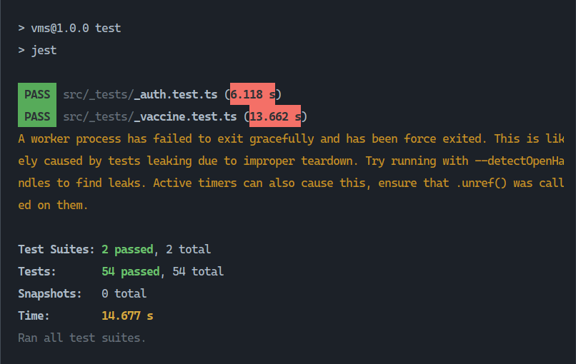
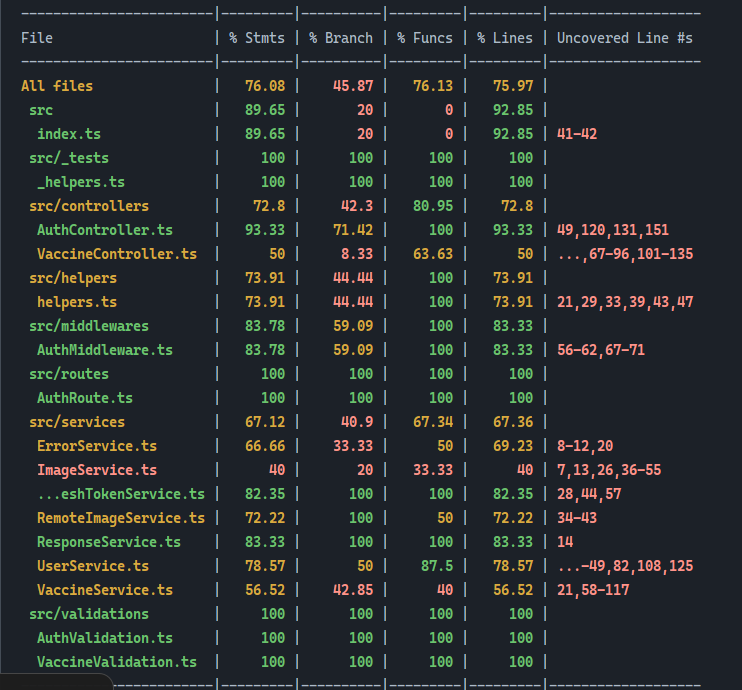

<p align="center">
    <a href="#">
        
    </a>
</p>
<h1 align="center" style="border: 0;"> Vaccine Management System </h1>

**Vaccine Management System** is as a name speaks, a system to keep track of the vaccines along with its details.

## Table Of Contents

- [Prerequisites](#prerequisites)
- [Installation](#installation)
- [Demo](#demo)
- [Tests](#tests)
- [Author](#author)
- [Contributors](#contributors)
- [License](#license)
- [Changelog](#changelog)

## Prerequisites

1. Your system needs to have NodeJs installed
   Install it from [https://nodejs.org/en/](https://nodejs.org/en/)

## Installation

First clone the github repo

```sh
git clone https://github.com/shreekrishnalamichhane/vms.git
```

On the root, run

```sh
docker compose up --detach --build
```

## Demo

Frontend Demo at : [https://vms.shreekrishnalamichhane.com.np](https://vms.shreekrishnalamichhane.com.np)
Backend Demo at : [https://vmss.shreekrishnalamichhane.com.np](https://vmss.shreekrishnalamichhane.com.np)

## Tests

###### Default Test

- Goto root directory
- Run `cd server`
- Run `npm test` or `yarn test`



###### Coverage Test

- Goto root directory
- Run `cd server`
- Run `npm test:coverage` or `yarn test:coverage`



## Author

**Author Name** &nbsp; : &nbsp; Shree Krishna Lamichhane<br>
**Author URI** &nbsp; &nbsp; &nbsp; : &nbsp; [shreekrishnalamichhane.com.np](https://shreekrishnalamichhane.com.np) <br>
**GitHub URI** &nbsp; &nbsp; &nbsp; : &nbsp; [shreekrishnalamichhane](https://github.com/shreekrishnalamichhane)

## Contributors

No Contributors on this project

## License

[](https://opensource.org/licenses/ISC)

## Changelog

[CHANGELOG.md](CHANGELOG.md)

---

Thank you for using this documentation.
